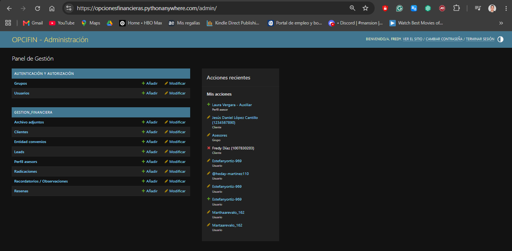
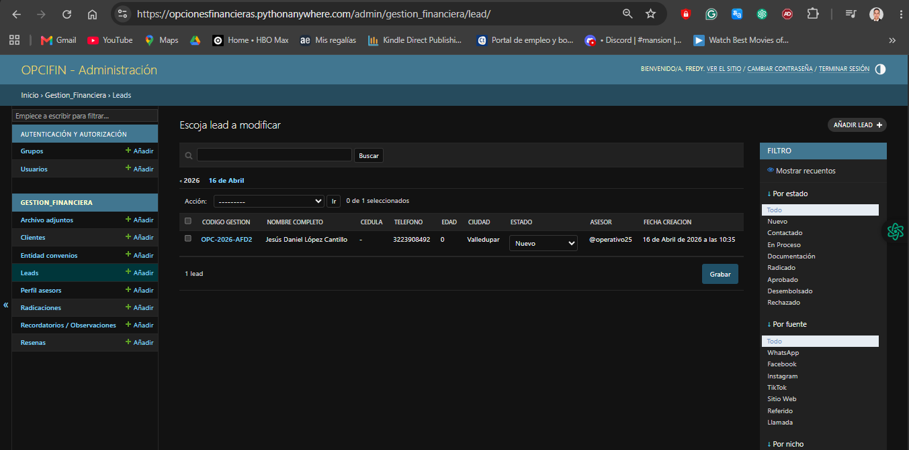
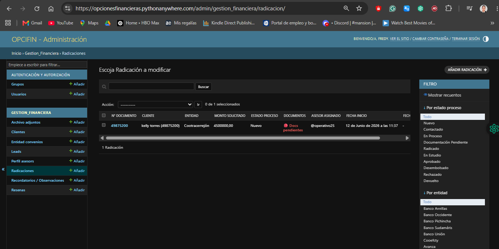

# CRM Financiero para Gestión de Créditos por Libranza

## Descripción

Sistema web y CRM desarrollado para una empresa del sector financiero especializada en créditos por libranza.

La solución fue diseñada para digitalizar procesos que anteriormente se realizaban de forma manual, permitiendo gestionar clientes, leads, radicaciones y documentación desde una única plataforma.

---

## Problema identificado

La empresa no contaba con:

- Sitio web corporativo.
- Captación digital de leads.
- Sistema de seguimiento comercial.
- Gestión centralizada de clientes.
- Control eficiente de radicaciones.

La información era gestionada manualmente, dificultando el seguimiento y control de los procesos.

---

## Solución desarrollada

Diseñé e implementé una plataforma web basada en Django que permitió:

- Captar prospectos desde el sitio web.
- Registrar clientes manualmente.
- Gestionar asesores.
- Realizar seguimiento de radicaciones.
- Organizar documentación asociada a créditos.
- Controlar el estado de cada solicitud.

---

## Funcionalidades principales

### Gestión de Leads

- Registro automático desde formularios web.
- Clasificación por estado.
- Asignación de asesor.
- Priorización de oportunidades.

### Gestión de Clientes

- Registro completo de información personal.
- Historial de seguimiento.
- Clasificación por perfil laboral.

### Gestión de Radicaciones

- Seguimiento de solicitudes.
- Control documental.
- Estados del proceso.
- Observaciones y recordatorios.

### Gestión de Usuarios

- Roles de acceso:
  - Asesor
  - Auxiliar
  - Coordinador

### Dashboard Operativo

- Indicadores básicos.
- Seguimiento de operaciones.
- Visualización de estados.

---

## Tecnologías utilizadas

- Python
- Django
- SQLite
- HTML
- CSS
- JavaScript
- Git
- GitHub
- PythonAnywhere

---

## Mi participación

Proyecto desarrollado de manera autónoma.

Responsabilidades:

- Levantamiento de requerimientos.
- Diseño funcional.
- Modelado de datos.
- Desarrollo backend.
- Desarrollo frontend.
- Despliegue.
- Mantenimiento.
- Soporte funcional.

---

## Capturas del sistema

## Capturas

### Dashboard

### Gestión de Leads

### Radicaciones

---

## Estado del proyecto

Versión funcional desplegada y utilizada en entorno real para gestión de procesos comerciales y financieros.
